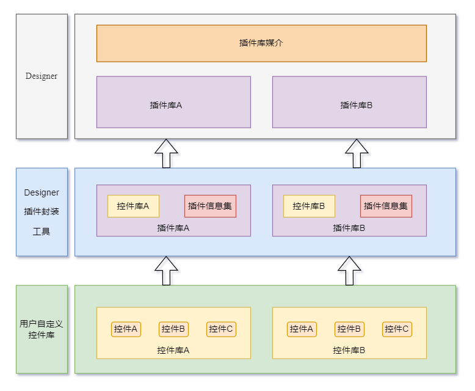
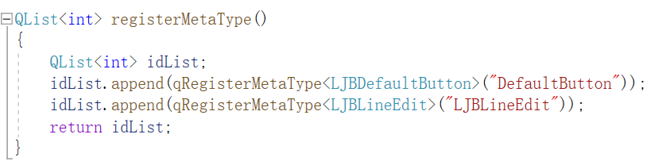
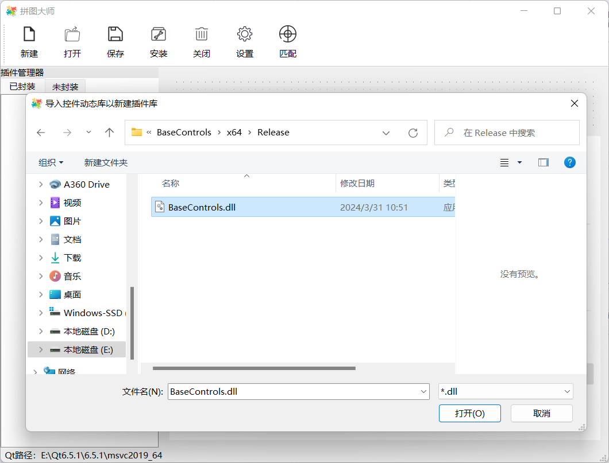
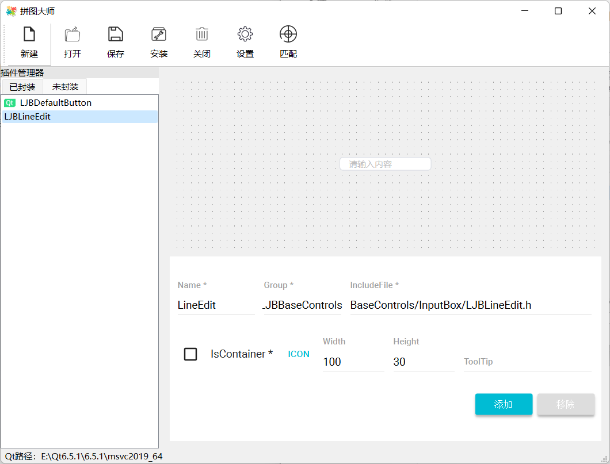
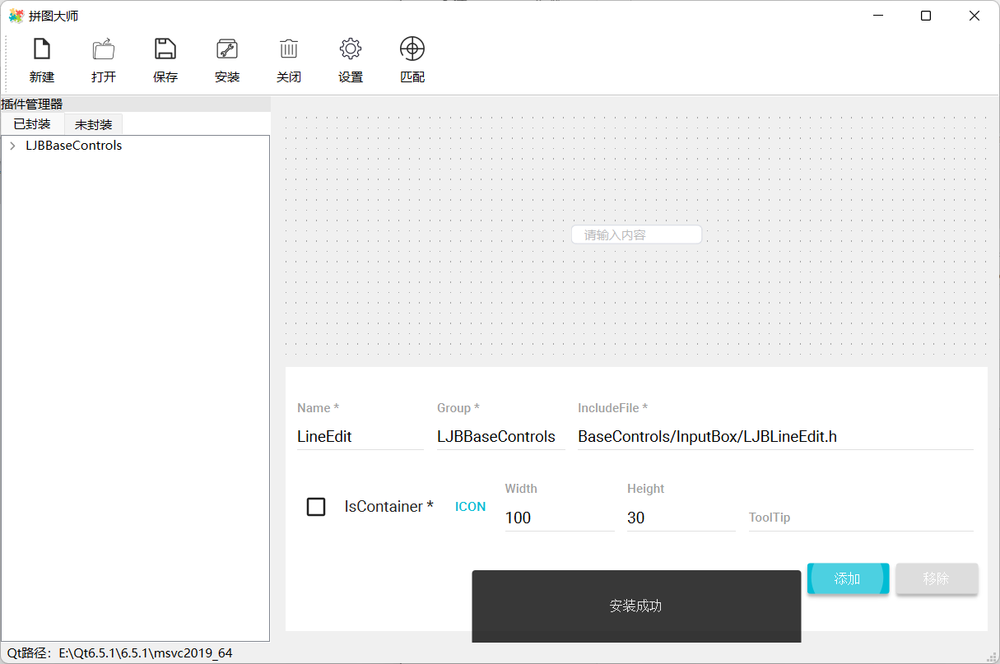
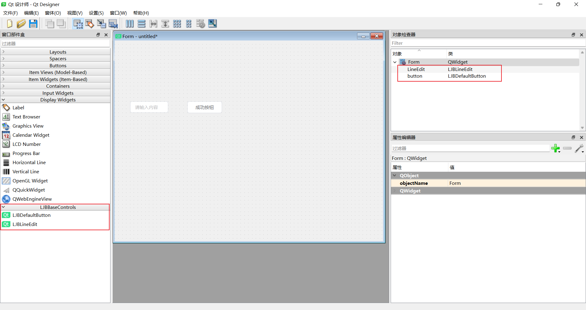

# qt-designer-plugin-tool

这是一个使用Qt开发的Qt Designer插件封装工具，便于Qt开发者将自定义组件封装为Qt Designer插件，实现在Qt Designer中如同使用Qt基础组件一样使用自定义组件。

## 系统架构：

## 使用说明：

步骤一：

在已开发的自定义组件库中添加如下接口。

步骤二：

启动工具，点击“新建”按钮，选择自定义组件库。（工具和自定义组件库都需要使用Release版本）

步骤三：

选中自定义组件，编辑信息，点击“添加”按钮。

步骤四：

点击“保存”按钮，接着点击“安装”按钮。

步骤五：

启动Qt Designer，使用自定义组件。

测试使用的自定义组件库：https://github.com/JiaboLi-GitHub/BaseControls